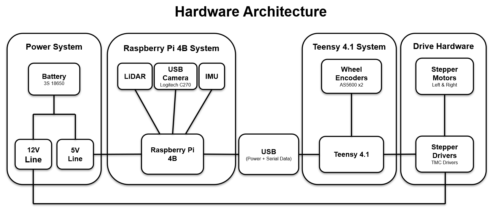
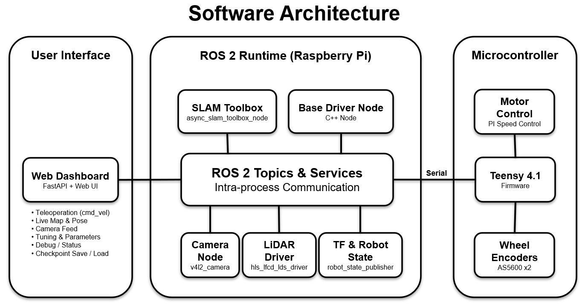

# Slambot Charlie

Charlie is a Raspberry Pi + Teensy ROS 2 SLAM robot built as a hands-on robotics engineering project. It combines differential-drive motion, closed-loop stepper control, wheel odometry, LiDAR mapping, a live camera feed, IMU yaw-rate sensing, optional EKF odometry fusion, and a custom web dashboard for field testing.

The goal of this project is simple: build a real robot that can drive, map, report what it is doing, and eventually navigate on its own. It is still a prototype, but the architecture is intentionally kept clean so each subsystem can be tested, explained, and improved without turning the whole robot into a mystery box.

## Current status

Working now:

- ROS 2 Humble workspace on a Raspberry Pi 4B
- Teensy 4.1 firmware for low-level stepper motor control and encoder feedback
- Closed-loop wheel speed control with runtime tuning
- Differential-drive wheel odometry
- SparkFun ICM-20948 IMU yaw-rate publisher on `/imu/data`
- Optional `robot_localization` EKF launch path for fused odometry
- ROBOTIS serial LiDAR on `/scan`
- Logitech C270 USB camera on `/camera/image_raw`
- `slam_toolbox` mapping with pose graph checkpoint save/load
- Custom FastAPI dashboard for teleoperation, camera, map display, tuning, IMU status, debug logs, and checkpoints
- URDF/Xacro model with `base_link`, wheel frames, `laser_frame`, `camera_link`, and `imu_link`

Still in progress:

- Final wheel coupling / chassis stiffness upgrades
- Final odometry and EKF tuning after the mechanical updates
- Long hallway / loop-closure mapping tests
- Autonomous navigation with Nav2
- Final demo videos and portfolio writeup

One practical note: the dashboard pose marker now tracks well during normal use. It can occasionally blip slightly off and come back, but that is being treated as a minor visualization/timing issue rather than a core mapping blocker.

## System overview

```text
Browser dashboard
  -> FastAPI dashboard node
  -> ROS 2 topics/services

Dashboard
  publishes /cmd_vel
  publishes /base_tuning_command
  subscribes /odom, /imu/data, /base_debug, /camera/image_raw, /map
  looks up map -> base_link
  calls slam_toolbox checkpoint services

Raspberry Pi base driver
  subscribes /cmd_vel
  publishes /odom by default
  publishes /base_debug
  publishes odom -> base_link TF by default
  sends serial commands to Teensy

IMU driver
  reads SparkFun ICM-20948 over Raspberry Pi I2C
  publishes /imu/data

Optional EKF mode
  remaps base driver odom output to /wheel/odom
  disables base driver odom -> base_link TF
  starts robot_localization
  publishes /odometry/filtered and odom -> base_link TF

Teensy firmware
  receives wheel speed targets
  controls stepper drivers
  reads wheel encoders
  sends odometry/debug packets back to the Pi

LiDAR
  publishes /scan

slam_toolbox
  consumes /scan and TF
  publishes /map
  publishes map -> odom
```

Current TF tree:

```text
map
└── odom
    └── base_link
        ├── left_wheel_link
        ├── right_wheel_link
        ├── laser_frame
        ├── camera_link
        └── imu_link
```

EKF localization target:

```text
base_driver_node -> /wheel/odom, no odom TF
charlie_imu_node -> /imu/data
robot_localization -> /odometry/filtered and odom -> base_link
slam_toolbox     -> uses fused odom/TF
```

## Architecture diagrams

These simplified diagrams are intended for portfolio presentation and quick repository orientation.

### Hardware Architecture



### Software Architecture



## Repository layout

```text
Slambot_Charlie/
├── README.md
├── architecture/
│   ├── hardware_architecture.md
│   ├── hardware_architecture.png
│   ├── software_architecture.md
│   └── software_architecture.png
├── config/
│   └── dds/fastdds_unicast_discovery.xml
├── ros2_ws/
│   └── src/
│       ├── charlie_bringup/
│       │   └── launch/bringup.launch.py
│       ├── charlie_base_driver/
│       │   ├── include/charlie_base_driver/
│       │   └── src/
│       ├── charlie_imu_driver/
│       │   ├── charlie_imu_driver/
│       │   └── launch/imu.launch.py
│       ├── charlie_web_dashboard/
│       │   ├── charlie_web_dashboard/
│       │   │   ├── api.py
│       │   │   ├── ros_interface.py
│       │   │   ├── web_dashboard_node.py
│       │   │   ├── static/
│       │   │   └── templates/
│       │   └── launch/web_dashboard_camera.launch.py
│       ├── charlie_description/
│       │   ├── launch/description.launch.py
│       │   └── urdf/charlie.urdf.xacro
│       └── charlie_navigation/
│           ├── config/ekf.yaml
│           ├── config/slam_toolbox.yaml
│           ├── launch/ekf.launch.py
│           └── launch/mapping.launch.py
├── scripts/
│   └── launch_charlie_unicast.sh
└── teensy_firmware/
    ├── platformio.ini
    ├── include/
    └── src/
```

## Main packages

### `charlie_bringup`

Top-level launch package. The main launch file starts the base driver, LiDAR, camera/dashboard, robot description, IMU driver, and mapping stack.

```bash
ros2 launch charlie_bringup bringup.launch.py
```

Mapping is enabled by default, but can be controlled with:

```bash
ros2 launch charlie_bringup bringup.launch.py mapping:=true
```

EKF mode is disabled by default while the robot is still being mechanically updated. When enabled, the launch file remaps base wheel odometry to `/wheel/odom`, disables the base driver's odom TF, and lets `robot_localization` publish fused odometry and `odom -> base_link`:

```bash
ros2 launch charlie_bringup bringup.launch.py ekf:=true
```

### `charlie_base_driver`

C++ ROS 2 node that bridges the Raspberry Pi and Teensy. It converts `/cmd_vel` into left/right wheel speed targets, sends those targets over serial, parses odometry/debug packets from the Teensy, publishes odometry, publishes `/base_debug`, and broadcasts `odom -> base_link` when EKF mode is disabled.

Current serial protocol:

```text
Pi -> Teensy:
V <left_mps> <right_mps>
C KP <value>
C KI <value>
C WHEEL_RADIUS <value>
C RESET_I

Teensy -> Pi:
O <left_total_m> <right_total_m> <left_speed_mps> <right_speed_mps> <status>
D <debug fields...>
```

### `charlie_imu_driver`

Python ROS 2 node for the SparkFun ICM-20948. It reads the IMU over Raspberry Pi I2C, performs startup gyro Z bias calibration, and publishes yaw-rate data on `/imu/data` with `frame_id: imu_link`.

### `charlie_web_dashboard`

Python/FastAPI dashboard used as the field operator console. It provides:

- browser teleoperation
- live camera feed
- live map image
- robot pose overlay
- runtime tuning controls
- IMU yaw-rate/status display
- debug log recording/download
- SLAM Toolbox checkpoint save/load

The dashboard runs on port `8000`.

```text
http://<robot-ip>:8000
```

### `charlie_description`

Xacro/URDF model for the robot frames and basic geometry. The model intentionally uses simple shapes instead of detailed meshes so TF and sensor placement stay easy to inspect.

Coordinate convention:

```text
x = forward
y = left
z = up
```

Important frames:

```text
base_link
left_wheel_link
right_wheel_link
laser_frame
camera_link
imu_link
```

### `charlie_navigation`

Mapping and localization configuration. It currently contains the `slam_toolbox` mapping launch/config and a `robot_localization` EKF launch/config. Scan matching is currently disabled because odometry-only mapping has behaved better in the current flat-wall test environment.

Future Nav2 configuration should live here as the navigation stack grows.

### `teensy_firmware`

PlatformIO firmware for the Teensy 4.1. It handles stepper output, AS5600 encoder reads, PI wheel speed control, serial command parsing, odometry packets, and debug packets.

Known firmware pin map:

| Signal | Teensy pin |
|---|---:|
| Left STEP | 29 |
| Left DIR | 31 |
| Left ENABLE | 32 |
| Right STEP | 1 |
| Right DIR | 2 |
| Right ENABLE | 3 |
| Default I2C SDA | 18 |
| Default I2C SCL | 19 |

The left AS5600 encoder uses the default `Wire` bus and the right encoder uses `Wire1`. Both use I2C address `0x36` in the current firmware.

## Hardware summary

| Subsystem | Current hardware |
|---|---|
| Main computer | Raspberry Pi 4B |
| Microcontroller | Teensy 4.1 |
| Drive | Differential-drive stepper motors |
| Motor drivers | TMC stepper drivers, exact model still to be documented |
| Encoders | AS5600-style magnetic encoders |
| LiDAR | ROBOTIS serial LiDAR via `hls_lfcd_lds_driver` |
| Camera | Logitech C270 USB webcam |
| IMU | SparkFun ICM-20948 |
| Battery | 3S 18650 lithium-ion pack |
| Prototype wiring | Solderable protoboard / practical hobbyist wiring |

## Build and run

Source ROS 2 and build the workspace:

```bash
source /opt/ros/humble/setup.bash
cd ~/Slambot_Charlie/ros2_ws
colcon build --symlink-install
source install/setup.bash
```

Launch the robot:

```bash
ros2 launch charlie_bringup bringup.launch.py
```

Launch the robot with Fast DDS unicast discovery:

```bash
cd ~/Slambot_Charlie
./scripts/launch_charlie_unicast.sh
```

Useful checks:

```bash
ros2 node list
ros2 topic list
ros2 topic hz /odom
ros2 topic hz /imu/data
ros2 topic hz /scan
ros2 topic hz /map
ros2 run tf2_ros tf2_echo map base_link
ros2 service list | grep slam_toolbox
```

When EKF mode is enabled, also check:

```bash
ros2 topic hz /wheel/odom
ros2 topic hz /odometry/filtered
ros2 run tf2_ros tf2_echo odom base_link
```

## Networking on multicast-restricted Wi-Fi

ROS 2 DDS discovery normally uses multicast so participants can find each other automatically. Managed Wi-Fi networks such as eduroam may block or isolate multicast traffic between clients. In that case, SSH and the browser dashboard can still work over normal unicast HTTP/TCP while ROS 2 discovery fails or behaves inconsistently.

For those networks, Charlie includes an optional Fast DDS unicast discovery profile:

```bash
cd ~/Slambot_Charlie
./scripts/launch_charlie_unicast.sh
```

The script sources ROS 2, sources the built workspace, exports `RMW_IMPLEMENTATION=rmw_fastrtps_cpp`, points `FASTDDS_DEFAULT_PROFILES_FILE` at `config/dds/fastdds_unicast_discovery.xml`, and then runs the normal bringup launch:

```bash
ros2 launch charlie_bringup bringup.launch.py
```

Additional launch arguments pass through to the normal bringup file, for example:

```bash
./scripts/launch_charlie_unicast.sh ekf:=true
```

To add an off-board ROS 2 peer later, edit `config/dds/fastdds_unicast_discovery.xml` and add a new locator in `initialPeersList` with the peer's current IP address. Add matching peer entries on the other host as well so both machines know where to send discovery meta-traffic.

This changes DDS discovery only. It does not change robot nodes, topics, TF ownership, SLAM Toolbox settings, EKF configuration, navigation behavior, firmware, or dashboard behavior. Launching with `ros2 launch charlie_bringup bringup.launch.py` directly continues to use the normal middleware defaults.

## Firmware build / upload

The Teensy firmware is a PlatformIO project.

```bash
cd ~/Slambot_Charlie/teensy_firmware
pio run
pio run -t upload
```

Before uploading, stop anything that may be holding the Teensy serial port:

```bash
sudo fuser -k /dev/ttyACM0
```

The base driver and any serial monitor should be stopped before flashing.

## Mapping workflow

1. Start the robot bringup launch.
2. Open the dashboard in a browser.
3. Drive slowly while watching the map and camera feed.
4. Save a checkpoint before stopping for battery charging.
5. Only reload a checkpoint if the robot has not physically moved since the save.

Checkpointing uses SLAM Toolbox pose graph serialization, not just a saved map image. That matters because it preserves the graph state needed to keep mapping from the same physical pose.

## Roadmap

Near-term work:

- Install final wheel couplings and chassis stiffness upgrades
- Retune wheel odometry after the mechanical updates
- Tune EKF covariances after odometry retune
- Retest hallway mapping with fused odometry

Longer-term work:

- Revisit SLAM scan matching after IMU/EKF improves yaw stability
- Add Nav2 for autonomous navigation
- Improve README with screenshots and demo videos
- Record a clean portfolio demo showing driving, mapping, camera, tuning, and checkpointing

## Project notes

This robot is intentionally built with practical parts and build methods: a Raspberry Pi, a Teensy, ROS 2, protoboard wiring, 3D-printed structure, and off-the-shelf sensors. The point is not to hide the messiness of a real prototype. The point is to make the mess understandable, testable, and gradually more reliable.
