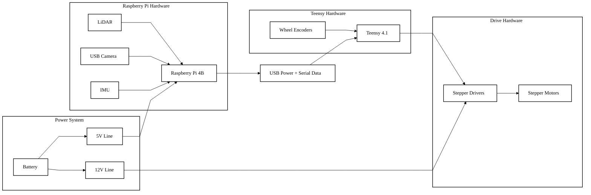

# Hardware Architecture

This diagram is a simplified hardware architecture view for the Slambot Charlie portfolio entry. It intentionally shows the main system relationships without listing every connector, pin, or part-specific detail.

