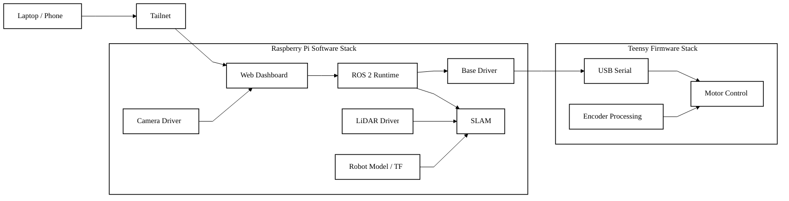

# Software Architecture

This diagram is a simplified software architecture view for the Slambot Charlie portfolio entry. It focuses on the main runtime blocks and control/data path rather than listing every ROS topic and service.

